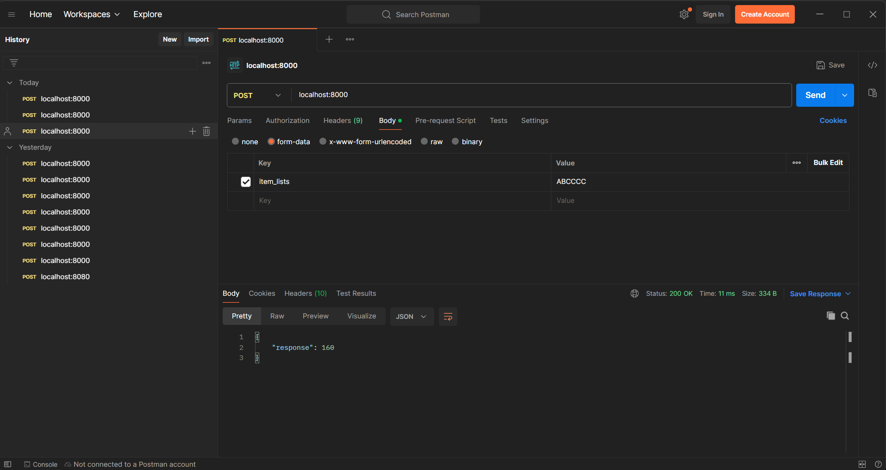
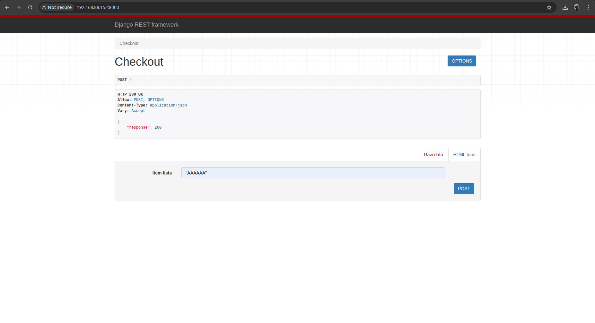

# Supermarket Backend Project

A robust and scalable Django-based backend application for managing supermarket-related operations. This guide provides step-by-step instructions on setting up the project, running it locally, and deploying it using Docker.

---

## Table of Contents

1. [Features](#features)  
2. [Requirements](#requirements)  
3. [Installation](#installation)  
4. [Setting Up the Django Backend](#setting-up-the-django-backend)
5. [Testing](#testing)
6. [Running the Project Locally & Verifying API Endpoints](#running-the-project-locally-&-verifying-api-endpoints)  
7. [Using Docker for Deployment](#using-docker-for-deployment)  
8. [Troubleshooting](#troubleshooting)  
9. [Future Enhancements](#future-enhancements)

---

## Features

- Centralized backend for supermarket management.
- CRUD operations for inventory, staff, and customers.
- REST API endpoints for data integration with frontend or other applications.
- Easily deployable using Docker.

---

## Requirements

Ensure you have the following installed on your system:

1. Python 3.8+  
2. Django 4.0+
3. Django Rest Framework
4. Docker and Docker Compose  
5. Git  
6. pip (Python Package Installer)  

---

## Installation

Clone the Repository
```bash
git clone https://github.com/your-username/supermarket.git
cd supermarket
```
## Setting Up the Django Backend
#### 1. Create and Activate a Virtual Environment
On Linux/MacOS:
```bash
python3 -m venv venv
source venv/bin/activate
```
On Windows:
```bash
python -m venv venv
venv\Scripts\activate
```
#### 2. Install Dependencies
```bash
pip install -r requirements.txt
```
```bash
pip install -r requirements.txt
```
#### 3. Start the Development Server
```bash
python manage.py runserver
```
Your application will be running on http://127.0.0.1:8000.

## 4. Testing
Test the Django App
```bash
python manage.py test supermaket
```

## Running the Project Locally & Verify API Endpoints
To verify everything is set up correctly:

Start the Django server using python manage.py runserver.</br>
Access the backend server at http://127.0.0.1:8000</br>

Verify API endpoints-


## Using Docker for Deployment

Install Docker and Docker Compose
Refer to the Docker Installation Guide for your operating system.

#### 1. Start the Docker daemon

```bash
sudo systemctl start docker
sudo systemctl enable docker
```
#### 2. Build the Docker image (OPTIONAL: As it is already built)
```bash
sudo docker-compose build
```
#### 3. Run the Application in a Container
```bash
sudo docker-compose up
```
This will expose the application on port 8000 (accessible via http://"your-host-ip":8000).


#### 4. Checking Running Containers
```bash
sudo docker ps
```
## Troubleshooting
#### 1. Port Already in Use
Check which process is using port 8000:
```bash
sudo lsof -i :8000
```
Kill the process using:
```bash
sudo kill -9 <PID>
```
#### 2. Cannot Access from Another Machine
Verify the firewall is not blocking port 8000:
```bash
sudo ufw allow 8000
```
Confirm the application is running on all interfaces (0.0.0.0).

## Future Enhancements
-Integrate frontend with the backend API.</br>
-Add integration tests.</br>
-Configure CI/CD pipeline for automated deployments.</br>
-Enhance security configurations for production.</br>
